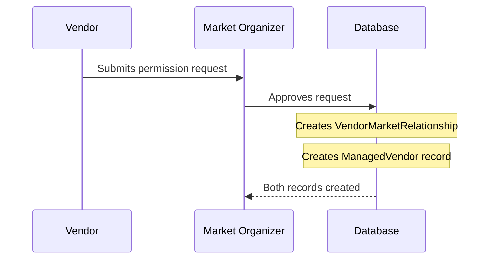

# Duplicate Vendor Display Issue - Solution Document

## Problem Description

When a market organizer approves a vendor permission request, the vendor appears **twice** in the market edit screen - once in "Approved Vendor Applications" and once in "Managed Vendors". This creates UX confusion even though the underlying data structure is correct.

## Current Flow Analysis

### 1. Permission Request Approval Flow


### 2. What Gets Created on Approval
**Location:** `lib/services/vendor_application_service.dart:296-304`

When a permission request is approved, the system creates:
1. **VendorMarketRelationship** record (via `VendorMarketRelationshipService.createRelationshipFromApplication()`)
2. **ManagedVendor** record (via `_createManagedVendorFromApplication()`)

```dart
// Permission request approval code
if (updatedApplication.isMarketPermission) {
  // Creates VendorMarketRelationship
  await VendorMarketRelationshipService.createRelationshipFromApplication(
    updatedApplication, reviewerId
  );
  
  // Creates ManagedVendor (THIS CAUSES THE DUPLICATE)
  await _createManagedVendorFromApplication(application, reviewerId);
}
```

### 3. Market Edit Screen Display Logic
**Location:** `lib/widgets/market_form_dialog.dart`

The market edit screen loads and displays vendors from TWO sources:

```dart
// Line 172: Loads approved applications (includes permission requests)
_approvedApplications = await VendorApplicationService.getApprovedApplicationsForMarket(widget.market!.id);

// Line 177: Loads managed vendors (includes vendors created from permission approvals)
_existingManagedVendors = await ManagedVendorService.getVendorsForMarketAsync(widget.market!.id);
```

**Display in UI:**
- **Lines 396-405**: "Approved Vendor Applications" section shows `_approvedApplications`
- **Lines 409-418**: "Managed Vendors" section shows `_existingManagedVendors`

**Result:** Same vendor appears in both sections when they came from a permission request approval.

## Solution Approach

### Option 1: Deduplicate by VendorId (RECOMMENDED)
Create a unified vendor list that shows each unique vendor only once, with proper labeling for their source.

**Benefits:**
- Clean, non-confusing UX
- Shows complete vendor relationship info
- Maintains all underlying data structures
- Clear source attribution (permission-based vs manually added)

### Option 2: Filter Permission-Based Vendors from Applications List
Don't show permission-based applications in the "Approved Applications" section since they already appear as managed vendors.

**Benefits:**
- Simpler implementation
- Keeps current UI structure

**Drawbacks:**
- Less clear about vendor source/history

## Recommended Implementation (Option 1)

### 1. Create Unified Vendor Data Structure
```dart
class UnifiedVendor {
  final String id;
  final String businessName;
  final String email;
  final VendorSource source;
  final VendorApplication? application;  // If from application
  final ManagedVendor? managedVendor;     // If managed directly
  final bool isSelected;
  
  // Factory methods for creation from different sources
  factory UnifiedVendor.fromApplication(VendorApplication application) { ... }
  factory UnifiedVendor.fromManagedVendor(ManagedVendor vendor) { ... }
}

enum VendorSource {
  permissionRequest,
  eventApplication, 
  manuallyCreated,
  marketInvitation
}
```

### 2. Update Market Form Dialog Logic
**File:** `lib/widgets/market_form_dialog.dart`

```dart
// Replace current loading logic
Future<void> _loadVendorData() async {
  setState(() => _isLoadingVendors = true);
  
  try {
    if (_isEditing) {
      // Load both data sources
      final approvedApplications = await VendorApplicationService.getApprovedApplicationsForMarket(widget.market!.id);
      final managedVendors = await ManagedVendorService.getVendorsForMarketAsync(widget.market!.id);
      
      // Create unified, deduplicated list
      _unifiedVendors = _createUnifiedVendorList(approvedApplications, managedVendors);
    }
  } catch (e) {
    debugPrint('Error loading vendor data: $e');
  } finally {
    setState(() => _isLoadingVendors = false);
  }
}

List<UnifiedVendor> _createUnifiedVendorList(
  List<VendorApplication> applications,
  List<ManagedVendor> managedVendors,
) {
  final Map<String, UnifiedVendor> vendorMap = {};
  
  // Add managed vendors first (they're the "canonical" record)
  for (final vendor in managedVendors) {
    vendorMap[vendor.vendorId] = UnifiedVendor.fromManagedVendor(vendor);
  }
  
  // Add applications that don't already exist as managed vendors
  for (final application in applications) {
    if (!vendorMap.containsKey(application.vendorId)) {
      vendorMap[application.vendorId] = UnifiedVendor.fromApplication(application);
    }
  }
  
  return vendorMap.values.toList();
}
```

### 3. Update UI Display
Replace the two separate sections with one unified section:

```dart
// Replace lines 395-420 in market_form_dialog.dart
if (_unifiedVendors.isNotEmpty) ...[
  Text(
    'Associated Vendors',
    style: Theme.of(context).textTheme.labelLarge?.copyWith(
      color: Colors.blue[700],
      fontWeight: FontWeight.w600,
    ),
  ),
  const SizedBox(height: 8),
  ...(_unifiedVendors.map((vendor) => _buildUnifiedVendorTile(vendor))),
  const SizedBox(height: 16),
],
```

### 4. Create Unified Vendor Tile Widget
```dart
Widget _buildUnifiedVendorTile(UnifiedVendor vendor) {
  final isSelected = _selectedVendorIds.contains(vendor.id);
  
  return Card(
    elevation: isSelected ? 3 : 1,
    color: isSelected ? Colors.blue[50] : null,
    child: CheckboxListTile(
      title: Text(vendor.businessName),
      subtitle: Column(
        crossAxisAlignment: CrossAxisAlignment.start,
        children: [
          Text(vendor.email),
          // Show source with appropriate icon/color
          Row(
            children: [
              _getSourceIcon(vendor.source),
              SizedBox(width: 4),
              Text(
                _getSourceLabel(vendor.source),
                style: TextStyle(
                  fontSize: 12,
                  color: _getSourceColor(vendor.source),
                  fontWeight: FontWeight.w500,
                ),
              ),
            ],
          ),
        ],
      ),
      value: isSelected,
      onChanged: (bool? value) {
        setState(() {
          if (value == true) {
            _selectedVendorIds.add(vendor.id);
          } else {
            _selectedVendorIds.remove(vendor.id);
          }
        });
      },
    ),
  );
}

Widget _getSourceIcon(VendorSource source) {
  switch (source) {
    case VendorSource.permissionRequest:
      return Icon(Icons.verified_user, size: 16, color: Colors.green);
    case VendorSource.eventApplication:
      return Icon(Icons.event, size: 16, color: Colors.orange);
    case VendorSource.manuallyCreated:
      return Icon(Icons.person_add, size: 16, color: Colors.blue);
    case VendorSource.marketInvitation:
      return Icon(Icons.mail, size: 16, color: Colors.purple);
  }
}

String _getSourceLabel(VendorSource source) {
  switch (source) {
    case VendorSource.permissionRequest:
      return 'Permission-Based';
    case VendorSource.eventApplication:
      return 'Event Application';
    case VendorSource.manuallyCreated:
      return 'Manually Added';
    case VendorSource.marketInvitation:
      return 'Market Invitation';
  }
}
```

## Testing Plan

### Test Scenario 1: Permission Request Flow
1. **Setup:** Create vendor and market organizer accounts
2. **Action:** 
   - Vendor requests permission to join market
   - Market organizer approves permission request
3. **Expected:** 
   - Vendor appears ONCE in market edit screen
   - Shows "Permission-Based" source label
   - Green verified icon displayed

### Test Scenario 2: Event Application Flow  
1. **Setup:** Create vendor and market organizer accounts
2. **Action:**
   - Vendor applies for specific event
   - Market organizer approves application
3. **Expected:**
   - Vendor appears ONCE in market edit screen  
   - Shows "Event Application" source label
   - Orange event icon displayed

### Test Scenario 3: Mixed Scenario
1. **Setup:** Market with both permission-based and event-based vendors
2. **Action:** Market organizer edits market
3. **Expected:**
   - Each vendor appears exactly once
   - Correct source labels for each vendor type
   - Appropriate icons for each source type

### Test Scenario 4: Edge Case - Same Vendor Multiple Applications
1. **Setup:** Vendor has both permission request AND event application approved
2. **Expected:** 
   - Vendor appears exactly once
   - Shows managed vendor data (canonical record)
   - Source shows "Permission-Based" (managed vendors take precedence)

## Implementation Checklist

- [ ] Create `UnifiedVendor` class and `VendorSource` enum
- [ ] Update `_loadVendorData()` method in market_form_dialog.dart
- [ ] Implement `_createUnifiedVendorList()` deduplication logic
- [ ] Create `_buildUnifiedVendorTile()` widget
- [ ] Add source icon and label helper methods
- [ ] Update UI to use single unified vendor section
- [ ] Test all scenarios listed above
- [ ] Remove old duplicate sections from UI
- [ ] Update any related documentation

## Files to Modify

1. **`lib/widgets/market_form_dialog.dart`** - Main UI and logic changes
2. **`lib/models/unified_vendor.dart`** - New model (create)
3. **Tests** - Add test cases for deduplication logic

This solution maintains the correct data structure (creating both VendorMarketRelationship and ManagedVendor records) while providing a clean, non-confusing user experience that shows each vendor exactly once with clear source attribution.